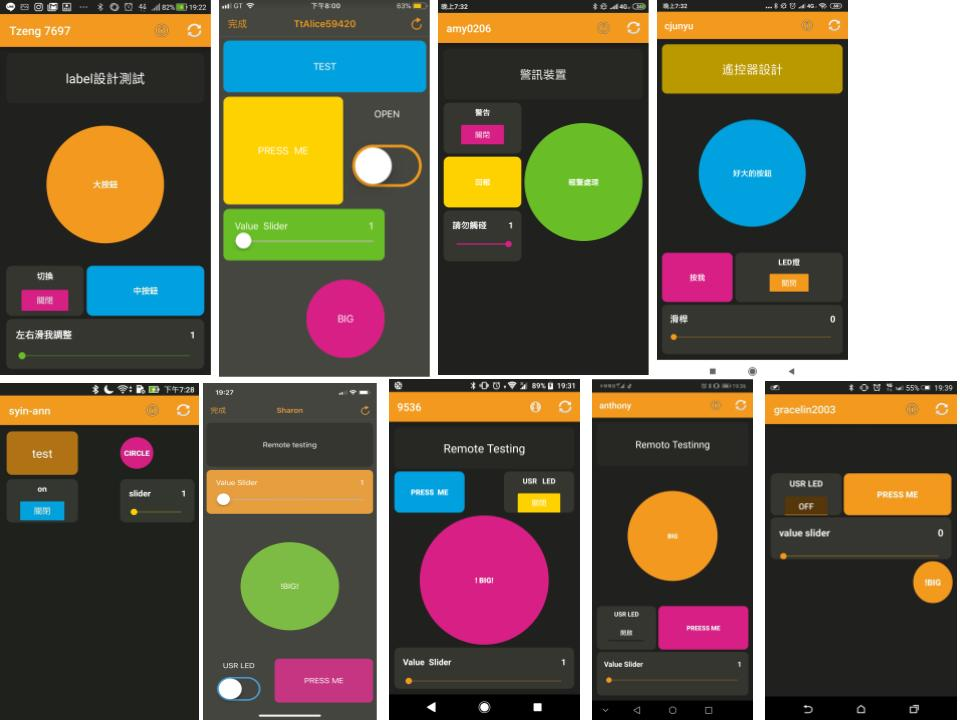

# 花蓮智慧教育中心 智慧家電之手機遙控課程 Github練習
* 手機畫面設計
* Github練習
* 設計成果：
{: width="100px"  height="100px")


標題語法：
```markdown
# 花蓮智慧教育中心 智慧家電支手機遙控課程 Github練習
```

清單語法：
```markdown
* 手機畫面設計
* Github練習
* 設計成果：
```

圖片語法(圖片檔案要先上傳)：
```markdown

```
